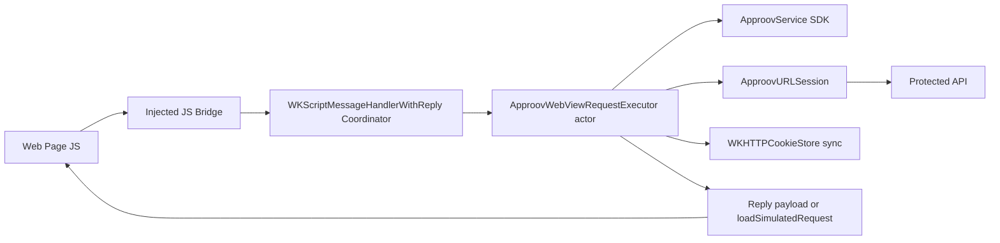

# JavaScript Bridge Design For Approov WebView

This document explains the JavaScript bridge used by this quickstart.

It is grounded in the implementation in:
- `WebViewShapes/ApproovWebViewBridge.swift`
- `WebViewShapes/ShapesQuickstartPage.swift` (demo page usage)

We install a JavaScript bridge at document start inside the WebView. It transparently wraps fetch, XHR, and current-frame form submits. Those requests are forwarded to native Swift using `WKScriptMessageHandlerWithReply`. Native code syncs cookies, applies native-only headers, fetches an Approov token, and sends the request through `ApproovURLSession` for dynamic pinning. The response is then returned back to JavaScript as a normal response object, or loaded as a simulated navigation for form flows. So web app code remains standard while security decisions stay in native code.

## 1. Why This Bridge Exists

Public `WKWebView` APIs do not provide a reliable way to mutate headers for arbitrary built-in browser requests before WebKit sends them.

For Approov integration, we need a controlled request path where native code can:
- request an Approov token
- inject the token into the request headers
- inject native-only secrets (for example API keys)
- apply dynamic pinning through `ApproovURLSession`

The bridge creates that controlled path by rerouting supported browser calls into native code.

## 2. Design Goals

The bridge is designed to:
- keep ordinary web code unchanged (`fetch`, `XMLHttpRequest`, normal forms)
- move protected networking decisions into native Swift
- preserve cookie/session continuity between WebKit and native networking
- support both API-style responses and page-navigation form flows
- fail closed or fail open based on app policy

The bridge is not designed to transparently cover every browser network primitive (see limitations section).

## 3. High-Level Architecture

## 4. Injection And Startup Lifecycle

## 4.1 Where injection happens

In `ApproovWebView.makeUIView(...)`, the app:
- builds a `WKUserScript` from `ApproovWebViewJavaScriptBridge.scriptSource(handlerName:)`
- injects at `injectionTime: .atDocumentStart`
- sets `forMainFrameOnly: false` (covers iframes too)
- registers `WKScriptMessageHandlerWithReply` on `WKUserContentController`
- registers in `contentWorld: .page` so page JS and bridge JS share the same JS world

## 4.2 Why `atDocumentStart` matters

This minimizes race windows. The wrappers are installed before page scripts run, so customer code calling `fetch` or `XMLHttpRequest` early in page boot still gets proxied.

## 4.3 Bridge activation checks

At runtime, injected JS first checks:
- `window.webkit?.messageHandlers?.<handlerName>`
- and that `postMessage` exists

If unavailable, the script exits immediately and does not override browser APIs.

When active, it sets:
- `window.__approovBridgeEnabled = true`
- `window.__approovBridgeFeatures = { fetch, xhr, forms, cookieSync, simulatedNavigations }`

These flags are useful for demos and troubleshooting.

## 5. What The JavaScript Bridge Intercepts

## 5.1 `fetch(...)`

Behavior:
- wraps `window.fetch`
- only proxies `http:` and `https:` URLs
- serializes method, headers, and body bytes (base64)
- forwards payload with `nativeHandler.postMessage(payload)`
- reconstructs a standard JS `Response` from native reply bytes

For non-HTTP(S) URLs (for example `data:` or `blob:`), it falls back to original browser `fetch`.

## 5.2 `XMLHttpRequest`

Behavior:
- replaces `window.XMLHttpRequest` with `ApproovXMLHttpRequest`
- preserves common XHR state transitions/events for proxied requests
- forwards requests to native with the same payload model
- reconstructs response fields (`status`, `statusText`, headers, body, `responseType`)

For non-HTTP(S) URLs, it creates and wires a real original `XMLHttpRequest` fallback.

## 5.3 HTML form submission

Covered paths:
- user-driven submit
- `form.submit()`
- `form.requestSubmit()`

The bridge:
- tracks submitter buttons to preserve per-button form overrides (`formaction`, `formmethod`, etc.)
- only proxies current-frame targets (`_self` or empty target)
- serializes form body based on method/enctype
- posts to native and handles one of two modes:

`response` mode:
- JS receives response payload
- dispatches `approov:form-response` or `approov:form-error`
- page remains on current document

`navigation` mode (default):
- native loads response using `loadSimulatedRequest(...)`
- WebView navigates to response like a page load

`data-approov-submit-mode="response"` enables response mode on a form.

## 6. Request Payload Contract (JS -> Native)

Current payload fields:
- `url`: absolute URL
- `method`: HTTP method
- `headers`: map of header name -> value
- `bodyBase64`: optional request body bytes
- `sourcePageURL`: current page URL (`window.location.href`)
- `responseHandling`: `"response"` or `"navigation"`
- `requestSource`: `"fetch" | "xhr" | "form"`

`bodyBase64` is used so binary and multipart payloads survive transport without encoding loss.

## 7. Native Forwarding Layer

The message handler is `WKScriptMessageHandlerWithReply` in `ApproovWebView.Coordinator`.

Flow:
- receives JS payload dictionary
- decodes it to `ApproovWebViewProxyRequest`
- runs `executor.execute(proxyRequest)` asynchronously
- returns one of:
  - proxy response object (for JS consumption)
  - navigation started object after `loadSimulatedRequest(...)`
- on failure, returns an error string that rejects the JS-side call

This gives a request/response RPC-style boundary between page JS and native Swift.

## 8. Native Execution Pipeline (Inside Executor)

`ApproovWebViewRequestExecutor` owns the protected path:

1. Parse and validate request (`http/https` only).
2. Sync WebKit cookies into native `HTTPCookieStorage`.
3. Apply browser context headers (`Referer`, and `Origin` for state-changing methods) when missing.
4. Apply app-specific `mutateRequest` callback for native-only headers/secrets.
5. If URL is configured for protection:
   - lazy initialize Approov SDK
   - fetch Approov token
   - set `approov-token` header if token exists
   - enable per-request pinning metadata
6. Execute with `ApproovURLSession.dataTask(...)` (not `data(for:)`) so Approov interception/pinning path is used.
7. Sync cookies back from native storage into WebKit.
8. Return response payload or simulated navigation load.

## 9. Approov Policy Branches

Protection decision:
- `shouldAttemptApproovProtection(url)` determines whether token/pinning should be attempted.

Failure policy:
- `allowRequestsWithoutApproovToken = false`: fail closed, request is rejected.
- `allowRequestsWithoutApproovToken = true`: fail open, request can continue without token.

Pinning policy:
- pinning is enabled per request when token was obtained in this flow.
- a request property key (`ApproovWebViewBridge.PinningEnabled`) is used to communicate that decision to the Approov mutator without exposing it as an HTTP header.

## 10. Response Contract (Native -> JS)

Response payload fields:
- `url`
- `status`
- `statusText`
- `headers`
- `bodyBase64`

JS reconstructs:
- a standard `Response` object for fetch
- XHR response state/body variants for XHR
- form events in response mode

For navigation mode, native applies `loadSimulatedRequest(...)` and returns `{ navigationStarted: true }`.

## 11. Cookie Continuity Design

Two stores are involved:
- WebKit store: `WKWebsiteDataStore.httpCookieStore`
- native store: `HTTPCookieStorage` used by `ApproovURLSession`

The bridge mirrors cookies:
- before request: WebKit -> native
- after request: native -> WebKit

This is critical for login/session/CSRF behavior when requests move between browser and native networking stacks.

## 12. Security Properties

Key security properties:
- page JS never sees native-only headers added in `mutateRequest`.
- Approov token acquisition stays in native code.
- protected requests can be restricted to explicit URL allowlist logic.
- fail-closed mode is available for strict production policy.

Operational recommendation:
- use fail closed (`allowRequestsWithoutApproovToken = false`) in production unless there is an explicit reason to fail open.

## 13. Known Platform And Semantic Limits

This design does not claim full browser-network interception. Public APIs still limit coverage for:
- arbitrary built-in WebKit subresource loads (`img`, `script`, `iframe`, CSS subresources)
- WebSockets
- Service Worker networking
- forms targeting other windows/frames
- full parity for every fetch/xhr semantic detail (for example abort/progress streaming behavior)

These are platform boundaries, not just implementation choices.

## 14. Questions

1. "Do web developers need a custom API?"
   - No. Existing `fetch`, `XMLHttpRequest`, and normal form submission can be used.

2. "Where are secret headers stored?"
   - In native Swift (`mutateRequest`), not in page JavaScript.

3. "What happens if token fetch fails?"
   - Controlled by policy: fail closed (reject) or fail open (continue without token).

4. "How do sessions stay intact?"
   - Cookies are mirrored both directions between WebKit and native storage per request.

5. "Does this cover every browser network call?"
   - No. It covers the supported flows above; some WebKit-managed traffic is not interceptable with public APIs.
