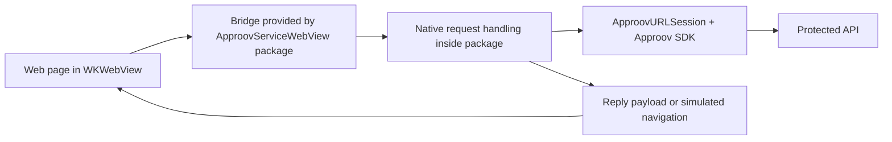

# JavaScript Bridge Design For Approov WebView

This repository does not contain the bridge implementation itself anymore.

It contains a sample app that consumes the external `ApproovServiceWebView` package and configures it for:

- a bundled local HTML page
- a hosted remote web app
- SwiftUI and UIKit host styles

This document explains the bridge-based architecture the quickstart relies on, while keeping the focus on the integration surface that still lives in this repo:

- `WebViewShapes/ContentView.swift`
- `WebViewShapes/QuickstartConfiguration.swift`
- `WebViewShapes/ShapesQuickstartPage.swift`
- `WebViewShapes/WebAssets/index.html`

## 1. Why This Bridge Exists

Public `WKWebView` APIs do not provide a reliable way to mutate headers for arbitrary built-in browser requests before WebKit sends them.

For Approov integration, we need a controlled request path where native code can:

- inject native-only secrets such as API keys
- let `ApproovURLSession` inject the Approov token
- apply dynamic pinning on protected requests

The external package provides that path by rerouting supported browser calls into native code.

## 2. What This Repo Is Responsible For

This repo only owns the app-side integration:

- which page gets loaded
- which host style is shown to the user
- which API hosts and path prefixes are protected
- which native-only headers are injected
- whether fail-open or fail-closed behavior is used

The bridge internals, request executor, cookie sync, and proxy implementation live in the package dependency, not in this repository.

## 3. High-Level Architecture

```mermaid
flowchart LR
    A["Web page in WKWebView"] --> B["Bridge provided by ApproovServiceWebView package"]
    B --> C["Native request handling inside package"]
    C --> D["ApproovURLSession + Approov SDK"]
    D --> E["Protected API"]
    C --> F["Reply payload or simulated navigation"]
    F --> A
```

## 4. Startup Flow In This Quickstart

At the app level, this quickstart does three things:

1. Builds an `ApproovWebViewConfiguration` in `QuickstartConfiguration.swift`.
2. Chooses content:
   - bundled file-backed HTML for the local demo
   - remote `URLRequest` for the hosted demo
3. Presents the content using:
   - `ApproovWebView` for SwiftUI
   - `ApproovWebViewController` for UIKit

That means the repo demonstrates integration patterns, not bridge implementation details.

## 5. Browser Flows The Bridge Protects

The quickstart is designed around the browser primitives the package supports:

- `fetch(...)`
- `XMLHttpRequest`
- current-frame HTML form submission

The bundled page in `WebViewShapes/WebAssets/index.html` exercises:

- a protected Fetch call
- a protected HTML form submit
- JSON rendering and UI updates in the page

## 6. Current Quickstart Configurations

The sample app currently exposes two configuration styles:

### 6.1 Local bundled Shapes demo

Configured by:

- `localContent`
- `localWebViewConfiguration`

Behavior:

- loads the bundled `index.html`
- protects `shapes.approov.io` on `/v2`
- injects the Shapes `Api-Key` natively

### 6.2 Hosted remote demo

Configured by:

- `hostedContent`
- `hostedWebViewConfiguration`

Behavior:

- loads `hostedWebViewURL`
- protects a separate API origin on `/api`
- keeps hosted sample values as replaceable placeholders in `QuickstartConfiguration.swift`

## 7. Protected Request Model

At a high level, the package does the following for allowlisted requests:

1. Intercepts supported browser calls.
2. Forwards request data into native code.
3. Syncs cookies between WebKit and native networking.
4. Applies `mutateRequest` so native-only headers can be added.
5. Uses `ApproovURLSession` for the protected request path.
6. Returns the response back to JavaScript, or loads it as a simulated navigation for form flows.

This lets the web app keep using normal browser APIs while the security-sensitive behavior remains in native code.

## 8. What Stays In Native Code

Important security properties of this design:

- page JavaScript does not need the API key
- token fetch stays in native code
- protected traffic is controlled by an explicit allowlist
- fail-open or fail-closed behavior is chosen in native configuration

In this repo, the only native customization point you are expected to edit is `QuickstartConfiguration.swift`.

## 9. Platform Limits

This architecture is intentionally scoped.

Public WebKit APIs still do not allow transparent interception for every browser network primitive, including:

- arbitrary built-in subresource requests
- WebSockets
- Service Worker networking
- forms targeting other windows or frames
- full parity for every Fetch/XHR semantic edge case

That is why the quickstart focuses on:

- Fetch
- XHR
- same-frame form submission

## 10. Practical Takeaway For This Repo

If you are reading this repository to understand what to change, the answer is:

- edit `QuickstartConfiguration.swift`
- swap out the bundled or hosted content source
- update the protected endpoint allowlist
- update native-only header injection
- choose whether SwiftUI, UIKit, or both hosts should remain in `ContentView.swift`

