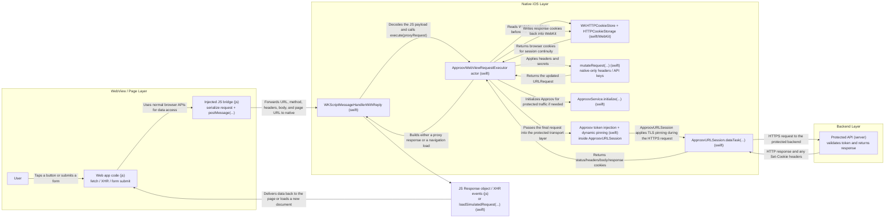
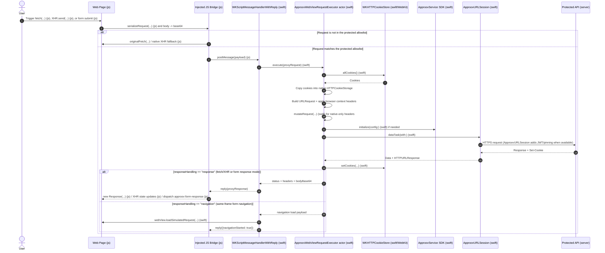

# Approov WebView Quickstart for iOS

Provides instructions on how to effectively protect WebView using the Approov SDK, including Approov Dynamic Pinning.

The quickstart is designed for WebView apps that need Approov protection on:

1. `fetch(...)`
2. `XMLHttpRequest`
3. current-frame HTML form submission

It also keeps browser cookies aligned between `WKWebView` and the native `URLSession` used to execute protected requests, which is critical for login, session, and CSRF flows.

## Why This Architecture

`WKWebView` does **not** provide a supported API for mutating headers on arbitrary built-in `https://` page requests before they leave WebKit's networking process.

Because of that, the safe approach is:

1. Inject a JavaScript bridge at document start.
2. Intercept only the protected Fetch, XHR, and current-frame form submission calls inside the page.
3. Forward those requests into native Swift with `WKScriptMessageHandlerWithReply`.
4. Sync WebKit cookies into native networking.
5. Initialize `ApproovURLSession` for the protected API allowlist.
6. Inject any native-only secrets, such as API keys, in Swift.
7. Execute the request natively and let `ApproovURLSession` add the token and apply pinning.
8. Return the response back to JavaScript or, for form navigations, load the native response into the WebView with `loadSimulatedRequest(...)`.

The demo page calls `https://shapes.approov.io/v2/shapes`, which also requires the API key `yXClypapWNHIifHUWmBIyPFAm`. The API key is injected natively so the page never needs to know it.

## Architecture Flow



## Detailed Runtime Sequence




## What This Quickstart Covers

The reusable bridge in `approov-service-ios-webview/Sources/ApproovServiceWebView/ApproovWebViewBridge.swift` covers:

- `fetch`
- `XMLHttpRequest`
- `form.submit()`
- user-driven HTML form submission
- `requestSubmit()` flows that eventually produce a normal submit event
- cookie synchronization between `WKHTTPCookieStore` and native `URLSession`
- simulated current-frame navigations for form responses using `WKWebView.loadSimulatedRequest(...)`
- dynamic pinning

That makes it suitable for the common WebView app pattern where:

- the UI lives in web content
- protected business APIs are called with Fetch/XHR
- some flows still rely on standard HTML forms

## Platform Limitations For Public WKWebView APIs

This quickstart intentionally does **not** claim impossible coverage.

Even with a strong bridge, public WebKit APIs still do not let an app transparently mutate headers on:

- arbitrary `` requests
- arbitrary `<script>` requests
- arbitrary `<iframe>` resource requests
- arbitrary CSS subresource requests
- WebSockets
- Service Worker networking
- forms targeting another window or named frame
- every browser semantic detail such as Fetch abort signals and XHR progress streaming

The safest production patterns are:

- keep protected API traffic on Fetch, XHR, or current-frame form submission
- keep static assets and page documents unprotected by Approov if they must be loaded by WebKit directly
- or route protected browser traffic through a same-origin backend/BFF that your WebView can call normally

## Project Structure

- `approov-service-ios-webview/`
  - Local Swift package for the reusable WebView service layer.
  - Exposes the `ApproovServiceWebView` product for Swift Package Manager consumers.
- `approov-service-ios-webview/Sources/ApproovServiceWebView/ApproovWebViewBridge.swift`
  - Reusable bridge code.
  - Includes both the SwiftUI `ApproovWebView` wrapper and the UIKit `ApproovWebViewController`.
- `WebViewShapes/QuickstartConfiguration.swift`
  - Demo-specific configuration.
  - This is the file most adopters should mirror first when wiring the package into their own app.
- `WebViewShapes/ShapesQuickstartPage.swift`
  - Local demo HTML loaded into the WebView.
  - Demonstrates both `fetch()` and real HTML form submission.
- `WebViewShapes/ContentView.swift`
  - Demo chooser that lets this one sample app present both the SwiftUI and UIKit host variants.
- `JS_BRIDGE_DESIGN.md`
  - Detailed design walkthrough of bridge injection, interception behavior, and JS/native forwarding.

## SwiftUI And UIKit Hosts

This sample now demonstrates both host styles in one app:

- `ApproovWebView`
  - SwiftUI wrapper around the protected `WKWebView`
- `ApproovWebViewController`
  - UIKit `UIViewController` that hosts the same protected `WKWebView`

If you only want one style in your own app:

- SwiftUI-only app
  - Keep `ApproovWebView`
  - Delete `ApproovWebViewController`
  - In `ContentView.swift`, comment out the UIKit demo case
- UIKit-only app
  - Keep `ApproovWebViewController`
  - Delete `ApproovWebView` and `import SwiftUI` from the package bridge source if you are forking it
  - In `ContentView.swift`, comment out the SwiftUI demo case

## Production Notes

### 1. Cookie continuity matters

The native proxy now mirrors cookies between:

- `WKWebsiteDataStore.httpCookieStore`
- native `URLSession`

Without that, many login and session flows break as soon as a request moves out of WebKit and into native networking.

### 2. Form submission support is explicit

The bridge now intercepts:

- user form submission
- `form.submit()`
- `requestSubmit()`

For standard same-frame form navigations, native Swift fetches the response and loads it back into the WebView using `loadSimulatedRequest(...)`.

For forms that should behave more like AJAX and stay on the current page, add:

```html
<form data-approov-submit-mode="response">
```

That makes the form dispatch:

- `approov:form-response`
- `approov:form-error`

instead of navigating away.

### 3. Fail-closed is the production recommendation

This sample currently keeps the earlier requested fail-open behavior:

- if Approov cannot produce a JWT, the request can still proceed without `approov-token`

That is controlled by:

- `allowRequestsWithoutApproovToken` in `QuickstartConfiguration.swift`

For a stricter production deployment, set it to `false`.

## What You Still Need To Do

The project builds as-is, but Approov will only issue valid JWTs when the account and app are configured correctly.

1. Add the protected API domain to Approov.

```bash
approov api -add shapes.approov.io
```

2. Ensure the backend validates Approov tokens.

If you adapt this quickstart to your own backend, the server must validate the JWT presented on the `approov-token` header.

3. Register the iOS app using Approov CLI

4. Test on a real device or configure a simulator/development path in your Approov account.

5. Replace the demo values in `QuickstartConfiguration.swift`:

- `approovConfig`
- `shapesEndpoint`
- `protectedEndpoints`
- `mutateRequest`

## Reusing the Bridge in Another App

### 1. Add the package dependency

This project now includes a local package:

- `approov-service-ios-webview`

The package depends on:

- `https://github.com/approov/approov-service-urlsession.git`
- `https://github.com/approov/approov-ios-sdk.git`

### 2. Import the package product

Import:

- `ApproovServiceWebView`

### 3. Create your own configuration

Example:

```swift
let config = ApproovWebViewConfiguration(
    approovConfig: "<your-approov-config>",
    protectedEndpoints: [
        ApproovWebViewProtectedEndpoint(
            host: "api.example.com",
            pathPrefix: "/v1/private"
        )
    ],
    approovTokenHeaderName: "approov-token",
    allowRequestsWithoutApproovToken: false,
    approovDevelopmentKey: "<your-dev-key>",
    mutateRequest: { request in
        var request = request

        if request.url?.host?.lowercased() == "api.example.com" {
            request.setValue("native-only-secret", forHTTPHeaderField: "Api-Key")
        }

        return request
    }
)
```

### 4. Present the WebView

```swift
ApproovWebView(
    content: .request(URLRequest(url: URL(string: "https://your-web-app.example")!)),
    configuration: config
)
```

Or load local HTML:

```swift
ApproovWebView(
    content: .htmlString(htmlString, baseURL: nil),
    configuration: config
)
```

## Best Practices

- Prefer a strict allowlist in `protectedEndpoints`.
- Keep native-only secrets in `mutateRequest`, never in page JavaScript.
- Keep protected endpoints on Fetch, XHR, or current-frame form submission.
- Keep the WebView on the default website data store unless you have a strong reason to isolate cookies.
- Set `allowRequestsWithoutApproovToken` to `false` for production unless you intentionally need fail-open behavior.
- If you fully own the web app, consider App-Bound Domains as an additional hardening layer for navigation scope.

## Sources

- [Approov Service for URLSession](https://github.com/approov/approov-service-urlsession)
- [Approov iOS Swift URLSession quickstart](https://github.com/approov/quickstart-ios-swift-urlsession)
- [Approov token fetch reference](https://github.com/approov/quickstart-ios-swift-urlsession/blob/master/REFERENCE.md#fetchtoken)
- [Apple `WKScriptMessageHandlerWithReply`](https://developer.apple.com/documentation/webkit/wkscriptmessagehandlerwithreply)
- [Apple `WKHTTPCookieStore`](https://developer.apple.com/documentation/webkit/wkhttpcookiestore)
- [Apple `WKWebView.loadSimulatedRequest`](https://developer.apple.com/documentation/webkit/wkwebview/loadsimulatedrequest(_:response:responsedata:))
- [Apple `WKWebViewConfiguration.setURLSchemeHandler`](https://developer.apple.com/documentation/webkit/wkwebviewconfiguration/seturlschemehandler(_:forurlscheme:))
